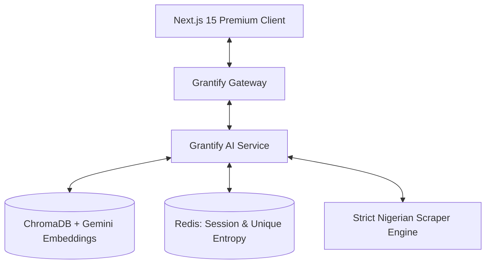

# 🚀 Grantify — Nigerian Scholarship & Grant Intelligence

**Grantify** is a professional-grade, multi-source RAG platform designed exclusively for Nigerians to discover and win grants and scholarships. Built for the 2026 technical landscape, it leverages generative AI and high-fidelity vector search to provide strategic application advice.

## 🌟 Unique Features

-   **Nigerian-Only Discovery**: Strict scraper filtering ensures 100% relevance for Nigerian applicants.
-   **Grantify Success Predictor**: AI-driven visual gauges that predict your application success odds in real-time.
-   **Automated Launch Intelligence (ALI)**: A custom power-script (`run_local.ps1`) that self-diagnoses and automatically triggers your browser for a premium startup experience.
-   **One-Click Sharing**: Instantly share high-value opportunities and AI advice directly to **WhatsApp, LinkedIn,** or **Email**.
-   **Traceable Reasoning**: Real-time **Thinking Pulse** visualization in the chat interface, showing the "brain" at work.

## 🏗️ Technical Architecture

## 🛠️ Stack

-   **Frontend**: Next.js 15, TypeScript, Tailwind CSS, Framer Motion, Lucide Icons.
-   **Gateway**: NestJS, Axios, Cache Manager (Redis).
-   **AI Service**: FastAPI, Pydantic, ChromaDB, Google Generative AI (Gemini 1.5 Flash).
-   **Data**: Supabase (Auth/Success Tracking), Redis (Caching/History).

## 🚀 Vision
To empower every Nigerian to unlock their potential through strategic, AI-guided access to global and local funding.
